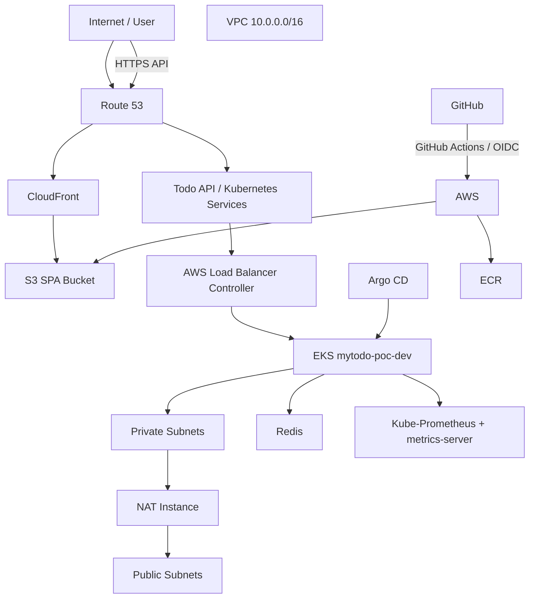
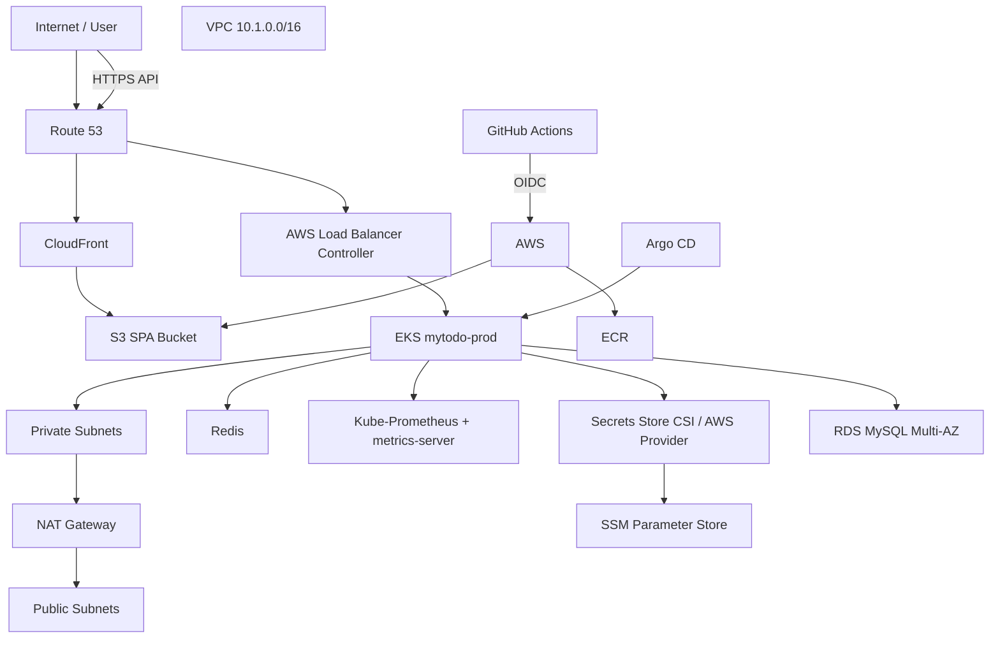

# myTodo AWS Architecture Design Document

**Document:** myTodo AWS Architecture Design  
**Environments:** Development and Production  
**Region:** AWS `ap-south-1`  
**Infrastructure as Code:** Terraform  
**Repository:** https://github.com/snagurum/myTodo_terraform  
**Source architecture diagram:** `myTodo-Architecture.pdf`  
**Document date:** 13 August 2026  
**Status:** As-built design / architecture reference

---

## 1. Executive Summary

The myTodo platform is deployed as two separate AWS environments:

- **Development:** `mytodo-poc-dev`
- **Production:** `mytodo-prod`

Both environments use Amazon VPC and Amazon EKS as the core application platform. The frontend is implemented as a static SPA hosted in Amazon S3 and delivered through Amazon CloudFront. DNS is managed through Amazon Route 53 and TLS certificates are provisioned through AWS Certificate Manager (ACM).

The production environment additionally contains a managed Amazon RDS for MySQL database and uses AWS Systems Manager Parameter Store through the EKS Secrets Store CSI integration for application secrets.

The Terraform repository is organized into reusable modules under `modules/` and environment-specific compositions under `live/dev` and `live/prod`. The repository also contains GitHub Actions workflows for the development and production Terraform deployments.

The supplied architecture diagram confirms the high-level environment topology: VPC, public/private subnets, NAT, EKS components, Redis, monitoring components, GitHub/Argo CD, and the public application/API domains.


---

## 2. High-Level Architecture

### 2.1 Development



### 2.2 Production



> The diagrams above are logical views. The supplied drawio is the primary visual reference for the deployed topology.

---

## 3. Environment Comparison

| Area | Development | Production |
|---|---|---|
| Project | `mytodo-poc` | `mytodo` |
| Environment | `dev` | `prod` |
| Region | `ap-south-1` | `ap-south-1` |
| VPC CIDR | `10.0.0.0/16` | `10.1.0.0/16` |
| Availability Zones | `ap-south-1a/b/c` | `ap-south-1a/b/c` |
| Public subnets | `10.0.1.0/24`, `10.0.2.0/24` | `10.1.1.0/24`, `10.1.2.0/24`, `10.1.3.0/24` |
| Private subnets | `10.0.11.0/24`, `10.0.12.0/24` | `10.1.11.0/24`, `10.1.12.0/24`, `10.1.13.0/24` |
| NAT | NAT instance | NAT Gateway |
| EKS version | `1.30` | `1.30` |
| EKS node desired | Module default: 3 | 4 |
| EKS node min/max | Module defaults: 1/4 | 2/5 |
| Frontend domain | `dev.snagurum.in` | `snagurum.in` |
| API domain | `api.dev.snagurum.in` | `api.snagurum.in` |
| ECR | `mytodo_dev_ecr` | `mytodo_ecr` |
| RDS MySQL | Mysql k8s Statefulset | Defined |
| RDS Multi-AZ | N/A | Enabled |
| Secrets integration | k8s configmaps | SSM + Secrets Store CSI |
| GitHub OIDC | Enabled | Enabled |

Note: Development and production are isolated at the VPC level. This separation reduces the blast radius of environment-specific failures and limits direct network-level interaction between environments.

---

## 4. Network Architecture

### 4.1 VPC

- Each environment has an isolated VPC with DNS hostnames and DNS support enabled.
- The environments therefore have non-overlapping address spaces.
- Both environments are configured for three Availability Zones.
- Production has three public and three private subnet CIDRs. Development currently defines two public and two private subnet CIDRs while listing three AZs.
- This is a deliberate environment-level difference: production uses the managed AWS NAT Gateway implementation, while development uses the lower-cost NAT instance implementation.

| Area | Development | Production |
|---|---|---|
| VPC | `10.0.0.0/16` | `10.1.0.0/16` |
| NAT | NAT Instance | NAT Gateway |
| Availability Zones | - `ap-south-1a, ap-south-1b, ap-south-1c` | - `ap-south-1a, ap-south-1b, ap-south-1c` |
| public/private subnets | 2/2 | 3/3 |

### 4.2 Public Subnets

Public subnet resources are associated with an Internet Gateway route and are tagged for AWS Load Balancer Controller use:

- `kubernetes.io/role/elb = 1`

The subnet implementation enables public IP assignment where the environment requests it.

### 4.3 Private Subnets

Private subnets are tagged:

- `kubernetes.io/role/internal-elb = 1`

EKS is configured using the private subnet IDs, so worker nodes are intended to run in private subnets.


---

## 5. DNS and TLS

- Route 53 is used for the hosted zone `snagurum.in`.
- The frontend Terraform creates Route 53 alias records pointing to the CloudFront distribution.
- ACM is used for frontend CloudFront certificates.
- Development also passes an ACM certificate ARN into the EKS add-on module for the API ingress/load-balancer controller.
- In production, `api.snagurum.in`; the exact production API ingress certificate configuration is handled through cert-manager.

| Area |Development | Production
|---|---|---|
| Frontend | `dev.snagurum.in` |  `snagurum.in`
| Alternate frontend | `www.dev.snagurum.in` |  `www.snagurum.in`
| API | `api.dev.snagurum.in` |  `api.snagurum.in`
| TLS-Frontend | ACM |  ACM
| TLS-Backend | ACM |  cert-manager

---

## 6. Frontend Architecture

The frontend is implemented as a static SPA.

Terraform creates:

1. Amazon S3 bucket
2. S3 public-access blocking
3. S3 versioning
4. CloudFront distribution
5. CloudFront Origin Access Control (OAC)
6. S3 bucket policy permitting CloudFront to read objects
7. ACM certificate integration
8. Route 53 alias records

The S3 bucket is not directly exposed publicly. CloudFront accesses the S3 origin through OAC using SigV4.

CloudFront:

- Redirects HTTP to HTTPS.
- Supports IPv6.
- Compresses content.
- Uses GET/HEAD for the default cache behavior.
- Uses a default TTL of 3600 seconds.
- Uses a maximum TTL of 86400 seconds.
- Returns `/index.html` for 403 and 404 errors with HTTP 200, supporting SPA client-side routing.

### Frontend flow

```text
User
  |
  v
Route 53
  |
  v
CloudFront
  |
  | OAC / SigV4
  v
S3 SPA Bucket
```

---


## 7. Amazon EKS Architecture

Both environments deploy Amazon EKS through the reusable `modules/core/eks` module.

The EKS cluster:

- Uses the environment-specific VPC.
- Uses private subnet IDs.
- Uses EKS cluster IAM role.
- Uses an EKS cluster security group.
- Uses Kubernetes version `1.30`.

### Node groups

The node group uses:

- Amazon Linux 2023 x86_64 standard AMI type.
- A Terraform-managed launch template.
- IMDSv2 with required tokens.
- EKS worker-node IAM policies.
- ECR read-only permissions.
- SSM Managed Instance Core permissions.
- The exact instance type is controlled by the reusable module variable and defaults to `t3.medium` when not overridden.

| Environment | Desired/Minimum/Maximum | Default
|---|---|---|
| Production |   4/2/5 | Custom |
| Development |  3/1/4 | Default |


---


## 8. EKS IAM and Workload Identity

### 8.1 EKS Cluster Role

The cluster role is assumed by:

`eks.amazonaws.com`

It has the AWS-managed `AmazonEKSClusterPolicy`.

### 8.2 EKS Node Role

The worker-node role includes:

- `AmazonEKSWorkerNodePolicy`
- `AmazonEKS_CNI_Policy`
- `AmazonEC2ContainerRegistryReadOnly`
- `AmazonSSMManagedInstanceCore`

### 8.3 OIDC / IRSA

The EKS module creates an IAM OIDC provider.

This is used by platform components such as:

- AWS Load Balancer Controller
- EBS CSI Driver
- SSM/Secrets Store CSI integration

This avoids putting broad AWS permissions directly onto every workload node or pod.

---

## 9. EKS Add-ons and Platform Services

The supplied architecture diagram and Terraform identify the following platform services.

### AWS Load Balancer Controller

The controller is deployed through Helm into `kube-system`.

It uses a Kubernetes service account associated with an IAM role through IRSA.

The configured listener ports are:

- HTTP 80
- HTTPS 443

The controller is responsible for integrating Kubernetes ingress/load-balancer resources with AWS load-balancing infrastructure.

### Argo CD

Argo CD is deployed through Helm.

The Terraform module installs:

- Chart: `argo-cd`
- Namespace: `argocd`
- Chart version: `9.4.12`

The architecture therefore supports a GitOps model where application Kubernetes resources can be reconciled by Argo CD.

### EBS CSI Driver

The EKS add-ons module installs the AWS EBS CSI driver as an EKS add-on and associates it with an IAM role.

This enables Kubernetes workloads to consume EBS-backed persistent volumes.

---

## 10. Secrets Management

Production uses AWS Systems Manager Parameter Store and the Kubernetes Secrets Store CSI integration.

The production environment creates:

`/mytodo/prod/db_password`

The parameter is a `SecureString`.

The database password is generated by Terraform using `random_password` and stored in SSM Parameter Store.

The EKS secrets provider module:

1. Installs Secrets Store CSI Driver.
2. Enables secret synchronization.
3. Enables secret rotation.
4. Enables the AWS provider.
5. Creates an IAM policy allowing `ssm:GetParameter` and `ssm:GetParameters`.
6. Creates an IRSA role.
7. Restricts the role to the environment parameter path.
8. Creates a namespace-specific service account.

This creates a path for Kubernetes workloads to retrieve AWS-managed secrets without embedding credentials into container images or source code.

---

## 11. Container Registry and CI/CD

Each environment has its own Amazon ECR repository.

### Development

`mytodo_dev_ecr`

### Production

`mytodo_ecr`

The Terraform repository also defines a GitHub OIDC deployment role.

The trusted repositories are:

- `snagurum/myTodo_fe`
- `snagurum/myTodo_be`

The GitHub role is permitted to:

- Upload/delete objects in the environment's frontend S3 bucket.
- Create CloudFront invalidations.
- Authenticate to ECR.
- Push images to ECR.

This supports keyless GitHub Actions authentication using AWS STS Web Identity rather than long-lived AWS access keys.

---

## 12. Database Architecture

The production environment contains an Amazon RDS for MySQL instance.

The database:

- Uses MySQL.
- Uses a private DB subnet group.
- Is not publicly accessible by default.
- Uses a dedicated database security group.
- Allows TCP/3306 from the configured private subnet CIDRs.
- Has 20 GB configured storage.
- Has automatic storage growth configured by the module.
- Has 7-day backup retention.
- Uses Multi-AZ in production.
- Has a defined backup window.
- Has a defined maintenance window.

### Database security boundary

```text
EKS / private application tier
          |
          | TCP 3306
          v
RDS Security Group
          |
          v
RDS MySQL
```

The RDS database is not exposed directly to the public Internet.

### Production database lifecycle note

The current production variables set:

- `db_deletion_protection = false`
- `db_skip_final_snapshot = true`

For demo purpose these setting are retained, for real production environment they will be hardened.

---


## 13. Application Traffic Flow

### Frontend

```text
Client
  |
  v
Route 53
  |
  v
CloudFront
  |
  v
S3
```

### API

The supplied architecture indicates API hostnames and an EKS ingress/load-balancer path:

```text
Client
  |
  v
api.dev.snagurum.in / api.snagurum.in
  |
  v
AWS Load Balancer Controller
  |
  v
Kubernetes Ingress / Service
  |
  v
Application Pod
```

<!-- The exact Kubernetes Ingress and Service manifests are not contained in the Terraform repository. -->
---


## 14. Security Architecture

Implemented controls include:

- Private subnets for EKS worker nodes.
- S3 Block Public Access.
- CloudFront OAC for S3.
- HTTPS/TLS for frontend delivery.
- IAM roles rather than embedded AWS credentials for EKS platform components.
- GitHub OIDC for CI/CD authentication.
- IMDSv2 required on EKS node launch templates.
- ECR read-only permissions for worker nodes.
- SSM SecureString for production database password.
- IRSA for SSM parameter access.
- RDS private accessibility.
- Dedicated RDS security group.
- EKS OIDC integration.
---

## 15. Deployment Model

The repository has separate GitHub Actions workflows:

- `terraform-dev.yml`
- `terraform-prod.yml`

The Terraform environment layout is:

```text
myTodo_terraform/
├── globals/
├── modules/
│   ├── core/
│   ├── eks-addons/
│   ├── eks-secrets-provider/
│   ├── github-oidc-role/
│   ├── spa/
│   └── vpc-full/
├── live/
│   ├── dev/
│   └── prod/
└── .github/
    └── workflows/
        ├── terraform-dev.yml
        └── terraform-prod.yml
```

This is a reusable-module architecture where common infrastructure logic is centralized under `modules/`, while environment-specific values are supplied from `live/dev` and `live/prod`.

---

## 16. Terraform Architecture

The main reusable building blocks are:

| Module | Responsibility |
|---|---|
| `modules/vpc-full` | VPC, public/private subnet composition and NAT |
| `modules/core/vpc` | VPC and Internet Gateway |
| `modules/core/subnet` | Subnets, routes and NAT |
| `modules/core/eks` | EKS cluster, node group, IAM and load balancer controller IAM |
| `modules/core/db-mysql` | RDS MySQL and DB subnet group |
| `modules/core/ecr` | ECR repository |
| `modules/core/acm` | ACM certificate |
| `modules/core/acm-cloudfront` | ACM/CloudFront certificate integration |
| `modules/spa` | S3 + CloudFront SPA hosting |
| `modules/eks-addons` | AWS Load Balancer Controller, Argo CD, EBS CSI |
| `modules/eks-secrets-provider` | Secrets Store CSI + SSM integration |
| `modules/github-oidc-role` | GitHub Actions OIDC deployment role |

---

## 17. Dependency Relationships

A simplified Terraform dependency chain is:

```text
VPC
 |
 +--> Public / Private Subnets
 |
 +--> EKS
 |     |
 |     +--> OIDC / IRSA
 |     |
 |     +--> EKS Add-ons
 |            |
 |            +--> AWS Load Balancer Controller
 |            +--> Argo CD
 |            +--> EBS CSI
 |
 +--> RDS (production)
 |
 +--> SPA
 |     |
 |     +--> S3
 |     +--> CloudFront
 |     +--> ACM
 |
 +--> ECR
 |
 +--> GitHub OIDC
```

---

## 18. Disaster Recovery Considerations

### RDS

Production currently has:

- Multi-AZ enabled.
- Seven-day automated backup retention.

---

